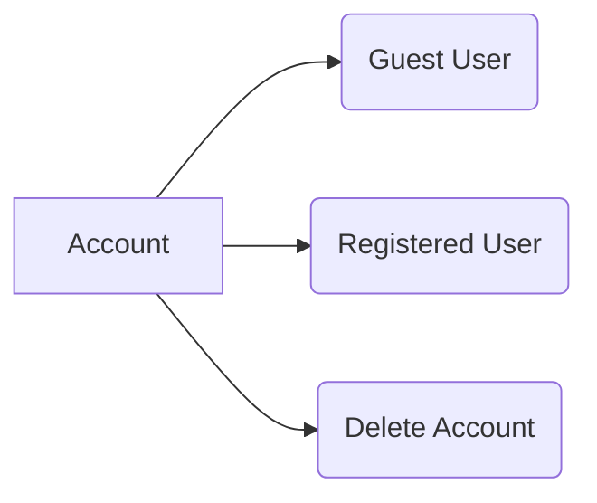
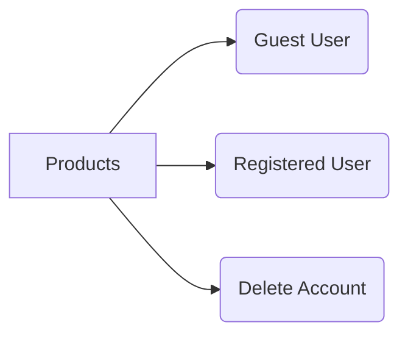
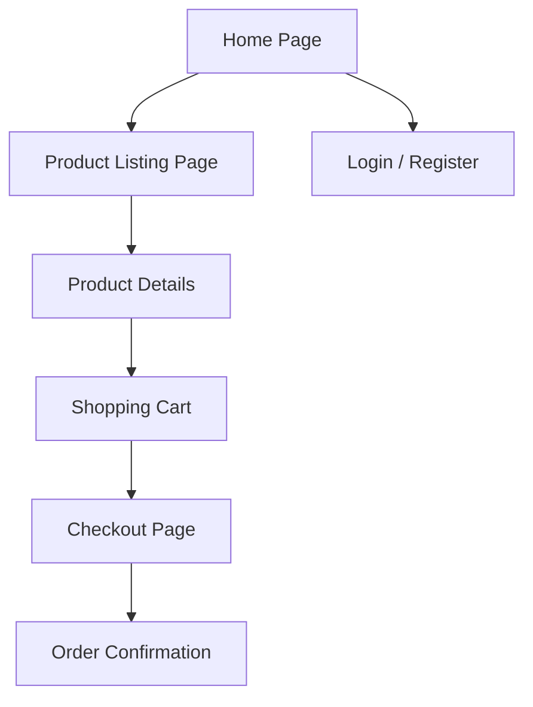
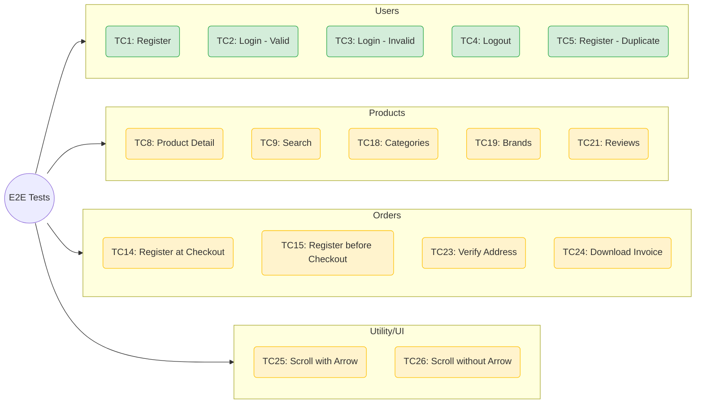
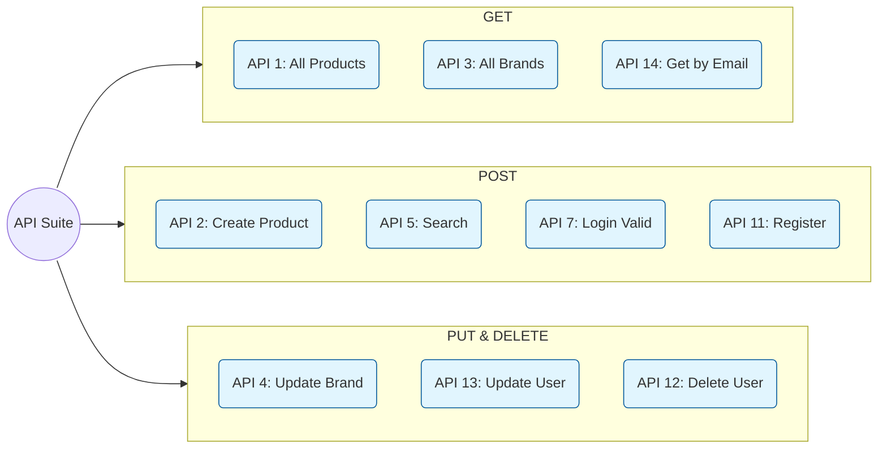

# QA Automation Framework – Plan & Roadmap

Design and evolution notes for the Automation Exercise QA portfolio project.

---

## Vision

A Playwright-driven framework that demonstrates professional Quality Engineering: layered test strategy, AI-assisted self-healing, clear configuration, and CI/CD integration.

---

## Architecture Decisions

| Area | Decision | Rationale |
|------|----------|-----------|
| **Test framework** | Playwright Test | Cross-browser, API + UI, strong tooling |
| **Structure** | POM for pages and API | Centralized logic, easier maintenance |
| **Fixtures** | User lifecycle (preCreated, persistent) | Ephemeral data, cleanup via API |
| **Config** | `src/config.ts` + env vars | Multi-environment, no hard-coded secrets |
| **AI healing** | Local Ollama, `@ai-healing` only | Demo capability without CI dependency |
| **Tags** | `@smoke`, `@api`, `@visual`, `@e2e`, `@flaky` | Layered suites, fast feedback |

---

## Implementation Status

### Done

- Environment & config: `src/config.ts`, `.env.sample`, README docs
- Smoke suite: `@smoke` on login, home, API create-user
- E2E place-order: `tests/e2e/place-order.logged.spec.ts`, `PaymentPage`, `PaymentDonePage`
- Test data strategy: `user-factory.ts`, `TEST_DATA_SEED`, README section
- Flakiness: `TestUtils.blockAds` / `prepareForScreenshot`, `@flaky` convention
- AI observability: `logHealing` with test name, decision, model; `healing-report.log`
- Documentation: Folder map, Representative Scenarios, README polish

---

## Page & Flow Design

### Account flows

### Product flows

### Page hierarchy

---

## Suggested Test Cases (UI)

---

## Suggested Test Cases (API)

---
